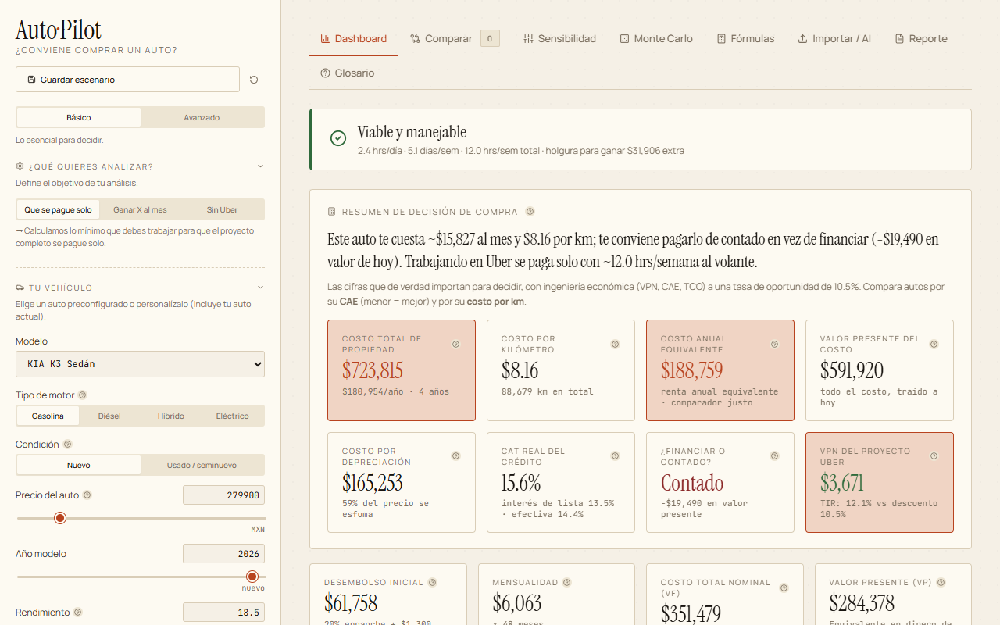
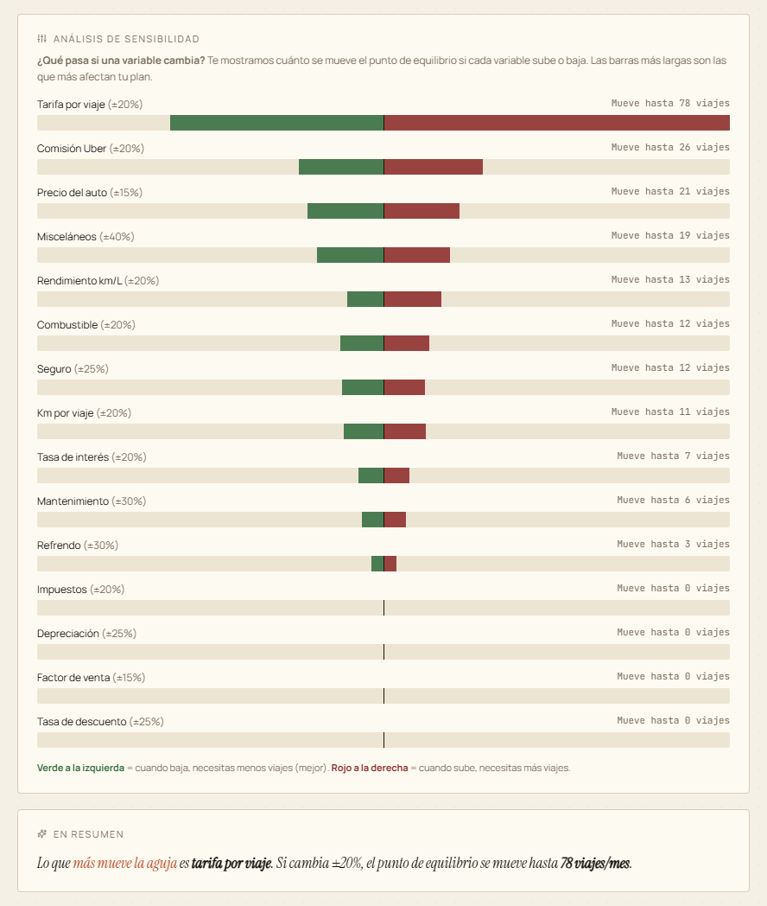

# Financial Sim

**Can this car pay for itself if you drive Uber on the side?** A browser-only simulator that answers with amortization, depreciation, break-even driving hours, sensitivity analysis and Monte Carlo instead of a guess.

It is for someone in Mexico deciding whether to buy a car (new or used, cash or credit) and cover it by driving for a ride-hailing platform, or who just wants the real cost of owning it. You enter the car, the financing and your city; the app works out the month-by-month cash flow, how many trips and hours a week you need to break even, and how likely the plan is to hold up when fares, fuel and resale value move.

   

**[Live demo](https://www.adriangaona.dev/demos/financial-sim/)** · [Project page](https://www.adriangaona.dev/work/financial-sim)

> **The UI is in Spanish on purpose.** The target user is in Mexico, so amounts are in MXN and the defaults (fares, fuel and electricity prices, platform commission, RESICO tax withholding) are Mexican. This README and the code comments are in English. In the app, the header reads **Auto·Pilot** and the browser tab reads *Auto-Pilot Uber Car Simulator*; the repo and portfolio call it Financial Sim.



| Sensitivity analysis | Monte Carlo (part-time driver) |
|---|---|
|  |  |

## Contents

- [Features](#features)
- [Tech stack and design decisions](#tech-stack-and-design-decisions)
- [Engineering highlights](#engineering-highlights)
- [Getting started](#getting-started)
- [Tests and checks](#tests-and-checks)
- [Configuration](#configuration)
- [Project structure](#project-structure)
- [Limitations](#limitations)
- [Background](#background)
- [License](#license)
- [Author](#author)

## Features

- **Purchase and financing:** cash, credit or a mix, with trade-in and acquisition fees. Credit can be a standard loan, a balloon loan or a lease. Shows an amortization chart, present vs. future value, and CAT (Mexico's total annual cost of credit, including the opening fee).
- **Three questions:** what you must drive to break even, what you must drive to hit a monthly profit target, or what the car costs with no Uber income at all.
- **Any powertrain:** gasoline, diesel, hybrid (optionally plug-in) or electric. EV charging time comes out of driving hours, and the app flags when daily km exceed usable battery range.
- **New or used:** declining-balance, straight-line or first-year-drop depreciation; a slower, age-adjusted rate for used cars; a warranty window and a repair reserve that grows with age.
- **Decision summary:** total cost of ownership, cost per km, equivalent annual cost, NPV (at your opportunity rate) and IRR, and a finance-vs-cash verdict in present value.
- **Risk tools:** a sensitivity tornado, Monte Carlo (1,000, 3,000 or 10,000 runs over 15 uncertain inputs, plus total-loss or theft risk), and a comparison of up to four editable cars alongside saved scenarios.
- **Explained, not just computed:** a Fórmulas tab with your values substituted into each equation, a narrative report with a print/PDF layout and a Markdown download, a glossary, and `?` tooltips on the technical terms.
- **LLM-assisted case import:** generates a research prompt that asks an LLM (ChatGPT, Claude, Gemini and so on) for a JSON profile of any car with a source for every value. Paste the answer back and the case loads with its sources listed; values that fail validation are skipped and named. The app itself calls no API.
- **Remembers your work:** inputs, saved scenarios, imported sources and the Basic/Advanced sidebar mode persist in `localStorage`.

## Tech stack and design decisions

React 19, Vite 6, Recharts 2 and lucide-react, written in plain JavaScript (JSX) with no TypeScript. Vitest, ESLint 9 and Prettier for the checks.

- **Static and client-only.** There is no backend. The build is a static bundle that nginx (see the `Dockerfile`) or any static host can serve, and your figures stay in your browser. The app makes no third-party requests: its fonts ship with it.
- **The model is separate from the UI.** `src/domain/` is plain JavaScript with no React imports, and `src/components/` only presents what it returns. That keeps the math runnable outside a browser and is what the tests exercise. [docs/ARCHITECTURE.md](docs/ARCHITECTURE.md) has the layer map and the dependency rule.
- **Time and randomness are inputs.** `src/domain/year.js` is the only code that reads the clock, and the Monte Carlo draws from an injectable random source. The app uses the real year and `Math.random`; tests pin both, so results are reproducible.
- **Outside data is untrusted.** The LLM's JSON goes through a field table: option fields must hold a known value, numbers must be finite, text must be a string and is length-capped. Anything else is skipped rather than reaching the model (an unknown powertrain used to zero the fuel cost). Its `sources` keep only plain keys with string values (at most 100), and a source becomes a link only if it parses as an `http:` or `https:` URL, shown with its hostname. Saved state gets the same schema check on load, and the inputs that size the model's loops are capped (horizon 30 years, loan and lease terms 120 months) wherever they come from ([`src/domain/inputSchema.js`](src/domain/inputSchema.js)).
- **Tabs load on demand.** Each tab is a lazy chunk, so the first download is the shell, the sidebar and the model: a 277 kB entry chunk, plus 31 kB of CSS, out of 843 kB of JavaScript in all. The default Dashboard still pulls the 383 kB charting chunk.
- **The copy is separate from the code.** Tooltip, glossary and source-label text live in `src/content/`, because the explanations are the product for someone who doesn't know finance.
- **Storage can't break the app.** Every `localStorage` access is wrapped in `try/catch` (`src/storage/persistence.js`, `src/App.jsx`, `src/components/Sidebar.jsx`), so private mode, full storage or a sandboxed iframe (where storage throws) only loses persistence, never the calculation. Saved state is schema-checked before use, and error boundaries turn a render error into a message with a way to clear the saved data instead of a blank page.

```text
Sidebar inputs ──▶ App.jsx state ──▶ calculate(inputs) ──▶ result ──▶ every tab and chart
                        │                    ▲
                        │                    ├── sensitivity.js   (one input at a time, ±15–40%)
                        │                    ├── monteCarlo.js    (randomized inputs, N runs)
                        │                    └── Comparison.jsx   (one call per car)
                        └──▶ localStorage
```

## Engineering highlights

1. **One pure model in named stages.** [`src/domain/calculate.js`](src/domain/calculate.js) turns one `inputs` object into the full result set the tabs read (cash flow by year, TCO, NPV, IRR, EAC, CAT, feasibility flags) through eight stages: financing, operating costs, liquidation, break-even, usage, feasibility, cash flow and economics. Sensitivity, Monte Carlo and the comparison tab call it again with modified inputs instead of re-implementing the math, so a new cost line shows up in every tab, chart and the report.
2. **Break-even solved per trip, consistent with kilometres.** Break-even trips are fixed monthly costs divided by the net contribution of one trip: fare, minus platform commission, minus tax under the chosen regime (RESICO, gross or net), minus energy and Uber-wear maintenance for that trip's km. Uber km are then derived from the resulting trips, so fuel and maintenance agree with the hours you must drive. A plan is only "feasible" if it fits your available hours, stays at or under 4 trips per hour and, for an EV, fits the battery range and charging time.
3. **Finance math from first principles.** [`src/domain/finance.js`](src/domain/finance.js) has `pmt`, standard and balloon amortization, `npv`, an `irr` that uses bisection and returns `NaN` when the cash flows never change sign (rather than a meaningless rate), a rate solver for CAT, and equivalent annual cost for comparing cars over different horizons.
4. **Reproducible Monte Carlo with a tail event.** [`src/domain/monteCarlo.js`](src/domain/monteCarlo.js) adds clamped normal noise (Box–Muller) to the 15 inputs in its `MC_VARIATIONS` table, which the Monte Carlo tab also renders, so the on-screen list cannot drift from the code. It models a total loss or theft with cumulative probability `1 − (1 − p)^years` and caps the insurance payout at the car's end-of-horizon market value, minus the deductible, so a write-off is never a windfall. Every draw goes through an injectable `rng`.
5. **Tests that pin the whole model.** [`test/calculate.characterization.test.js`](test/calculate.characterization.test.js) stores the complete 125-key result of `calculate()` for seven input sets (every powertrain, new and used, cash, mixed, loan, balloon and lease, all three operation modes, an infinite break-even and a loan that outlives the horizon) as order-preserving JSON with `NaN`, `Infinity` and `-0` spelled out. They were captured before `calculate()` was split into stages and still match byte for byte. Unit tests cover the finance functions, depreciation, sensitivity, the seeded Monte Carlo, the input limits, the import and saved-state checks, and the report text and Markdown escaping.

## Getting started

**Prerequisites:** Node.js 20.9+ or 22+ (see `engines` in `package.json`; verified with Node 20.10 and npm 10.5) and Git. Docker is optional; its build uses Node 22.

```bash
git clone https://github.com/jadrianlg16/financial-sim.git && cd financial-sim
npm ci
npm run dev        # http://127.0.0.1:5173 (Vite moves to the next free port if it is taken)
```

Production build:

```bash
npm run build      # static bundle in dist/
npm run preview    # serves dist/ at http://127.0.0.1:4173
```

Docker (multi-stage: builds on `node:22-alpine`, serves with `nginx:alpine` running as its unprivileged `nginx` user, with the security headers in [`nginx/default.conf`](nginx/default.conf): a Content-Security-Policy limited to the app's own files, no cross-origin framing, no server version):

```bash
docker build -t financial-sim .
docker run --rm -p 5006:80 financial-sim    # http://localhost:5006
```

### Using the model without the UI

The domain layer is ES modules with no browser dependencies, so Node can import it directly. From the repo root:

```bash
node --input-type=module -e "
import { pmt } from './src/domain/finance.js';
import { calculate } from './src/domain/calculate.js';
import { DEFAULT_INPUTS } from './src/domain/defaults.js';
console.log(pmt(100000, 0.12, 12).toFixed(2));   // 8884.88: 100,000 at 12%/yr over 12 months
const r = calculate(DEFAULT_INPUTS);             // or calculate(inputs, { year: 2026 }) to pin 'now'
console.log({ monthlyPayment: r.monthlyPayment, breakEvenTrips: r.breakEvenTrips, npv: r.npvProject, feasible: r.feasible });
"
```

## Tests and checks

```bash
npm test               # Vitest, once (npm run test:watch to re-run on save)
npm run lint           # ESLint; any warning fails
npm run format:check   # Prettier (npm run format rewrites)
```

The tests cover the domain layer, the saved-state checks and the report's text builders, with no browser and no network. The characterization snapshots live in `test/__snapshots__/calculate/`, one JSON file per scenario. When a change to the model is intended, regenerate them with `npx vitest run -u` and review the JSON diff like any other change.

[`.github/workflows/ci.yml`](.github/workflows/ci.yml) runs `npm ci`, lint, the format check, the tests and the build on Ubuntu and Windows with Node 20 and 22.

## Configuration

The app reads no environment variables. All scenario values are set in the UI. The starting scenario is `src/domain/defaults.js`, and the car and city presets (Mexican list prices, fares and fuel prices) are in `src/domain/constants.js`. The current year comes from the system clock.

## Project structure

```text
src/
├── main.jsx                    entry point
├── App.jsx                     tabs (lazy-loaded), top-level state, persistence effect
├── domain/                     the financial model: plain JS, no React
│   ├── calculate.js            core model: inputs → one result object, in named stages
│   ├── finance.js              pmt, amortization (standard and balloon), npv, irr, CAT, EAC
│   ├── depreciation.js         depreciation methods and the used-car rate
│   ├── energy.js               energy cost per powertrain, EV charging time
│   ├── sensitivity.js          one-at-a-time sensitivity (tornado)
│   ├── monteCarlo.js           randomized runs, percentiles, histogram
│   ├── aiCase.js               LLM research prompt and validated JSON import
│   ├── inputSchema.js          allowed values, input limits, saved-state and sources checks
│   ├── year.js                 the reference year (the only clock read)
│   └── compare.js, carDisplay.js, constants.js, defaults.js, format.js
├── components/                 one file per tab or panel, plus CrashScreen
│   ├── dashboard/              the Dashboard's KPI grid and chart cards
│   ├── comparison/             a car column, the verdict, the chart and the decision table
│   ├── formulas/               the formula groups (credit, project, economics)
│   ├── sidebar/                the side panel's input groups
│   ├── report/                 report sections and its text and Markdown builders
│   └── ui/                     Field, Group, Info, Segmented, SourceCell, ErrorBoundary
├── content/                    tooltip, glossary and source-label copy (Spanish)
├── storage/persistence.js      localStorage access and the saved-state check
└── theme/theme.css             color variables, layout and component styles
test/
├── *.test.js                   unit tests per module, plus the characterization test
├── __snapshots__/calculate/    full calculate() output per scenario (JSON)
├── fixtures/scenarios.js       the seven input sets
└── helpers/                    lossless JSON serializer, seeded random generator
public/                         favicon.svg, fonts-LICENSE.txt
docs/
├── ARCHITECTURE.md             layers, dependency rule, state, tests
├── REQUISITOS.md               requirements log (Spanish)
└── screenshot-*.png
.github/workflows/ci.yml        lint, format check, tests and build
nginx/default.conf              security headers for the Docker image
Dockerfile                      build with Node, serve dist/ with nginx as a non-root user
```

## Limitations

- **Spanish-only UI, MXN only, Mexico-specific defaults.** Car prices, city fares, fuel and electricity prices, the platform commission and the tax regimes are fixed Mexican numbers in `constants.js` and `defaults.js`, not live market data.
- **Monte Carlo runs on the main thread and the app does not seed it.** The page blocks while a simulation runs, and results vary slightly from run to run (the tests use a seeded generator).
- **Simplified operating model.** Income is average fare × trips, a month is 30 days, and per-km maintenance assumes a 20,000 km/year baseline. Break-even trips cover year-one running costs (energy is averaged over the horizon); general cost inflation, the used-car repair reserve and a lease's excess-km penalty are charged in the year-by-year cash flow but not in the break-even, so the net result at "break-even" can be negative. The tool supports a decision; it is not financial advice.
- **Imported cases are only as good as the LLM's answer.** The app validates the shape of each value and lists the sources it gets back, but it cannot verify them.

## Background

It started as an engineering-economics course project (evaluate a car-purchase project as a "financial consultant") and grew into a general car-purchase decision tool. The requirements history is in [docs/REQUISITOS.md](docs/REQUISITOS.md) (Spanish).

## License

Copyright © 2026 Adrián Gaona. All rights reserved. The source is public so it can be read and evaluated; no license is granted to reuse or redistribute it.

Third-party components keep their own licenses: React, Recharts and Vite (MIT), lucide-react (ISC), and the Instrument Serif, Manrope and JetBrains Mono fonts, bundled from the Fontsource packages (SIL Open Font License 1.1; the license texts ship as `fonts-LICENSE.txt` from [`public/`](public/fonts-LICENSE.txt)).

## Author

**Adrián Gaona** · [adriangaona.dev](https://www.adriangaona.dev) · [LinkedIn](https://www.linkedin.com/in/jesus-lopez-95762b2b6) · [GitHub](https://github.com/jadrianlg16)
