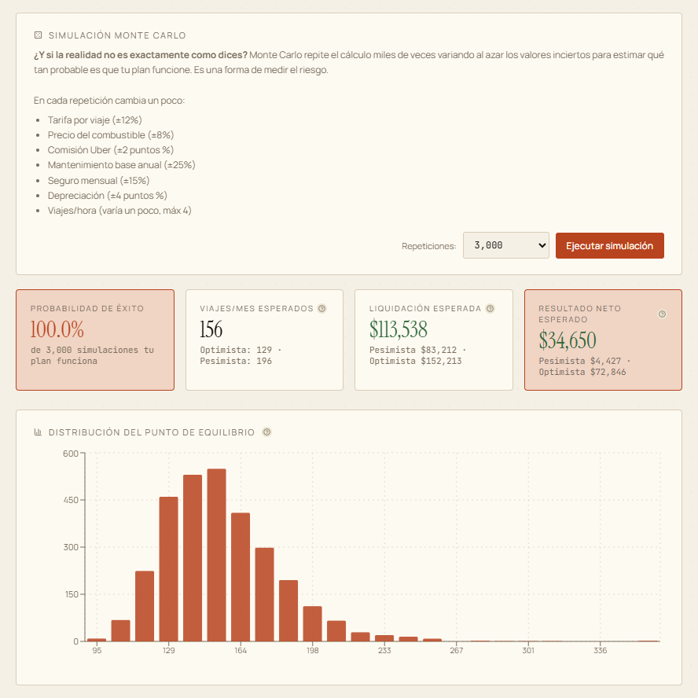

# Financial Sim

**Can this car pay for itself if you drive Uber on the side?** A browser-only simulator that answers with amortization, depreciation, break-even driving hours, sensitivity analysis and Monte Carlo instead of a guess.

It is for someone in Mexico deciding whether to buy a car (new or used, cash or credit) and cover it by driving for a ride-hailing platform, or who just wants the real cost of owning it. You enter the car, the financing and your city; the app works out the month-by-month cash flow, how many trips and hours a week you need to break even, and how likely the plan is to hold up when fares, fuel and resale value move.

   

**Live demo:** https://www.adriangaona.dev/demos/financial-sim/ · [Project page](https://www.adriangaona.dev/work/financial-sim)

> **The UI is in Spanish on purpose.** The target user is in Mexico, so amounts are in MXN and the defaults (fares, fuel and electricity prices, platform commission, RESICO tax withholding) are Mexican. This README is in English. The app's own header calls it **AutoPilot**; the repo and portfolio call it Financial Sim.


| Sensitivity analysis | Monte Carlo |
|---|---|
|  |  |

## Contents

- [Features](#features)
- [Tech stack and design decisions](#tech-stack-and-design-decisions)
- [Engineering highlights](#engineering-highlights)
- [Getting started](#getting-started)
- [Tests](#tests)
- [Configuration](#configuration)
- [Project structure](#project-structure)
- [Limitations](#limitations)
- [Background](#background)
- [License](#license)
- [Author](#author)

## Features

- **Purchase and financing:** cash, credit or a mix, with trade-in and acquisition fees. Credit can be a standard loan, a balloon loan or a lease. Shows an amortization chart, present vs. future value, and CAT (Mexico's total annual cost of credit, including the opening fee).
- **Three questions:** what you must drive to break even, what you must drive to hit a monthly profit target, or what the car costs with no Uber income at all.
- **Any powertrain:** gasoline, diesel, hybrid (optionally plug-in) or electric. EV charging time comes out of driving hours, and the app flags when daily km exceed usable battery range.
- **New or used:** declining-balance, straight-line or first-year-drop depreciation; a slower, age-adjusted rate for used cars; a warranty window and a repair reserve that grows with age.
- **Decision summary:** total cost of ownership, cost per km, equivalent annual cost, NPV (at your opportunity rate) and IRR, and a finance-vs-cash verdict in present value.
- **Risk tools:** a sensitivity tornado, Monte Carlo (1,000, 3,000 or 10,000 runs, including total-loss or theft risk), and a comparison of up to four editable cars alongside saved scenarios.
- **Explained, not just computed:** a Fórmulas tab with your values substituted into each equation, a narrative report with a print/PDF layout, a glossary, and `?` tooltips on the technical terms.
- **LLM-assisted case import:** generates a research prompt that asks an LLM (ChatGPT, Claude, Gemini and so on) for a JSON profile of any car with a source for every value. Paste the answer back and the case loads with its sources listed. The app itself calls no API.
- **Remembers your work:** inputs, saved scenarios, imported sources and the Basic/Advanced sidebar mode persist in `localStorage`.

## Tech stack and design decisions

React 19, Vite 6, Recharts 2 and lucide-react, written in plain JavaScript (JSX) with no TypeScript.

- **Static and client-only.** There is no backend. The build is a static bundle that nginx (see the `Dockerfile`) or any static host can serve, and your figures stay in your browser. The only third-party request the app makes is for three font families from Google Fonts.
- **The model is separate from the UI.** `src/domain/` is plain JavaScript with no React imports, and `src/components/` only presents what it returns. That keeps the math runnable outside a browser and ready for unit tests. [docs/ARCHITECTURE.md](docs/ARCHITECTURE.md) has the layer map and the dependency rule.
- **The copy is separate from the code.** Tooltip, glossary and source-label text live in `src/content/`, because the explanations are the product for someone who doesn't know finance.
- **Storage can't break the app.** Every `localStorage` read and write is wrapped in `try/catch` (`src/storage/persistence.js`, `src/App.jsx`, `src/components/Sidebar.jsx`), so private mode or full storage only loses persistence, never the calculation.

```text
Sidebar inputs ──▶ App.jsx state ──▶ calculate(inputs) ──▶ result ──▶ every tab and chart
                        │                    ▲
                        │                    ├── sensitivity.js   (one input at a time, ±15–40%)
                        │                    ├── monteCarlo.js    (randomized inputs, N runs)
                        │                    └── Comparison.jsx   (one call per car)
                        └──▶ localStorage
```

## Engineering highlights

1. **One pure model, many views.** [`src/domain/calculate.js`](src/domain/calculate.js) takes one `inputs` object and returns the full result set the tabs read: cash flow by year, TCO, NPV, IRR, EAC, CAT and the feasibility flags. Sensitivity, Monte Carlo and the comparison tab call it again with modified inputs instead of re-implementing the math. A new cost line therefore shows up in every tab, chart and the report.
2. **Break-even solved per trip, consistent with kilometres.** Break-even trips are fixed monthly costs divided by the net contribution of one trip: fare, minus platform commission, minus tax under the chosen regime (RESICO, gross or net), minus energy and Uber-wear maintenance for that trip's km. Uber km are then derived from the resulting trips, so fuel and maintenance agree with the hours you must drive. A plan is only "feasible" if it fits your available hours, stays at or under 4 trips per hour and, for an EV, fits the battery range and charging time (`calculate.js`).
3. **Finance math from first principles.** [`src/domain/finance.js`](src/domain/finance.js) has `pmt`, standard and balloon amortization, `npv`, an `irr` that uses bisection and returns `NaN` when the cash flows never change sign (rather than a meaningless rate), a rate solver for CAT, and equivalent annual cost for comparing cars over different horizons.
4. **Monte Carlo with a tail event.** [`src/domain/monteCarlo.js`](src/domain/monteCarlo.js) adds clamped normal noise (Box–Muller) to fare, commission, km and trips per hour, energy prices, maintenance, insurance, depreciation, resale factor and other running costs, then reruns `calculate()`. It also models a total loss or theft with cumulative probability `1 − (1 − p)^years`, and caps the insurance payout at the car's end-of-horizon market value, minus the deductible, so a write-off is never a windfall. It reports success rate, P10/P50/P90 and a histogram. [`src/domain/sensitivity.js`](src/domain/sensitivity.js) chooses its variable list per powertrain and mode, then ranks them into the tornado.
5. **LLM import with a guarded merge.** [`src/domain/aiCase.js`](src/domain/aiCase.js) builds a prompt for a fixed JSON schema that asks for a source per value and for estimates to be marked `[ESTIMACIÓN]`. [`ImportCase.jsx`](src/components/ImportCase.jsx) strips code fences and reports parse errors. `applyImportedJson` copies only known fields, coerces numbers, and accepts tax regime, financing type, condition and insurance mode only from their allowed values. Inside the model, small guards (`num`, `clamp`, `positive` in [`format.js`](src/domain/format.js)) turn a malformed number into a safe default instead of letting `NaN` spread through the results.

## Getting started

**Prerequisites:** Node.js 20 or 22+ and Git (verified with Node 20.10 and npm 10.5; the Docker build uses Node 20). Docker is optional.

```bash
git clone https://github.com/jadrianlg16/financial-sim.git && cd financial-sim
npm ci
npm run dev        # http://127.0.0.1:5173 (Vite moves to the next free port if it is taken)
```

Production build:

```bash
npm run build      # static bundle in dist/
npm run preview    # serves dist/ at http://127.0.0.1:4173
```

Docker (multi-stage: builds on `node:20-alpine`, serves with `nginx:alpine`):

```bash
docker build -t financial-sim .
docker run --rm -p 5006:80 financial-sim    # http://localhost:5006
```

### Using the model without the UI

The domain layer is ES modules with no browser dependencies, so Node can import it directly. From the repo root:

```bash
node --input-type=module -e "
import { pmt } from './src/domain/finance.js';
import { calculate } from './src/domain/calculate.js';
import { DEFAULT_INPUTS } from './src/domain/defaults.js';
console.log(pmt(100000, 0.12, 12).toFixed(2));   // 8884.88: 100,000 at 12%/yr over 12 months
const r = calculate(DEFAULT_INPUTS);
console.log({ monthlyPayment: r.monthlyPayment, breakEvenTrips: r.breakEvenTrips, npv: r.npvProject, feasible: r.feasible });
"
```

## Tests

There is no automated test suite yet, and `package.json` has no `test` script. Today's checks are manual: `npm run build` compiles every module, [docs/ARCHITECTURE.md](docs/ARCHITECTURE.md) has a `grep` that confirms `src/domain/` imports no React, and the snippet above exercises the model from Node. Because the domain layer is pure, unit tests can import it directly. Adding them is the next step.

## Configuration

The app reads no environment variables. All scenario values are set in the UI. The starting scenario is `src/domain/defaults.js`, and the car and city presets (Mexican list prices, fares and fuel prices) are in `src/domain/constants.js`.

## Project structure

```text
src/
├── main.jsx                  entry point
├── App.jsx                   tabs, top-level state, persistence effect
├── domain/                   the financial model: plain JS, no React
│   ├── calculate.js          core model: inputs → one result object
│   ├── finance.js            pmt, amortization (standard and balloon), npv, irr, CAT, EAC
│   ├── depreciation.js       depreciation methods and the used-car rate
│   ├── energy.js             energy cost per powertrain, EV charging time
│   ├── sensitivity.js        one-at-a-time sensitivity (tornado)
│   ├── monteCarlo.js         randomized runs, percentiles, histogram
│   ├── aiCase.js             LLM research prompt and JSON case import
│   └── compare.js, carDisplay.js, constants.js, defaults.js, format.js
├── components/               one file per tab or panel, plus ui/ primitives
├── content/                  tooltip, glossary and source-label copy (Spanish)
├── storage/persistence.js    localStorage reads
└── theme/FontsAndTheme.jsx   CSS variables and font import
docs/
├── ARCHITECTURE.md           layers, dependency rule, state and persistence
├── REQUISITOS.md             requirements log (Spanish)
└── screenshot-*.png
Dockerfile                    build with Node, serve dist/ with nginx
```

## Limitations

- **Spanish-only UI, MXN only, Mexico-specific defaults.** Car prices, city fares, fuel and electricity prices, the platform commission and the tax regimes are fixed Mexican numbers in `constants.js` and `defaults.js`, not live market data.
- **The current year is hardcoded.** Year labels are `2025 + n` and car age is `2026 − model year` (`calculate.js:266` and `:316`, `depreciation.js:7`, `Report.jsx:14` and `:16`, plus the same pattern in `Dashboard.jsx` and `Comparison.jsx`). From 2027 on, the labels and used-car ages will be off by a year.
- **No automated tests** (see [Tests](#tests)).
- **One 840 kB JavaScript bundle** (about 235 kB gzipped) with no code splitting, and `vite build` warns about it.
- **Monte Carlo runs on the main thread and is unseeded.** The page pauses during a run, and results vary from run to run.
- **Simplified operating model.** Income is average fare × trips, a month is 30 days, and per-km maintenance assumes a 20,000 km/year baseline. The tool supports a decision; it is not financial advice.
- **Imported cases are only as good as the LLM's answer.** The app lists the sources it gets back but cannot verify them.
- **Hosted demo:** the demo site is served through Cloudflare, which injects its Web Analytics beacon into the page. That script is not part of this repo; running locally avoids it.

## Background

It started as an engineering-economics course project (evaluate a car-purchase project as a "financial consultant") and grew into a general car-purchase decision tool. The requirements history is in [docs/REQUISITOS.md](docs/REQUISITOS.md) (Spanish).

## License

Copyright © 2026 Adrián Gaona. All rights reserved. The source is public so it can be read and evaluated; no license is granted to reuse or redistribute it.

Third-party components keep their own licenses: React, Recharts and Vite (MIT), lucide-react (ISC), and the Instrument Serif, Manrope and JetBrains Mono fonts loaded from Google Fonts (SIL Open Font License 1.1).

## Author

**Adrián Gaona** · [adriangaona.dev](https://www.adriangaona.dev) · [LinkedIn](https://www.linkedin.com/in/jesus-lopez-95762b2b6) · [GitHub](https://github.com/jadrianlg16)
